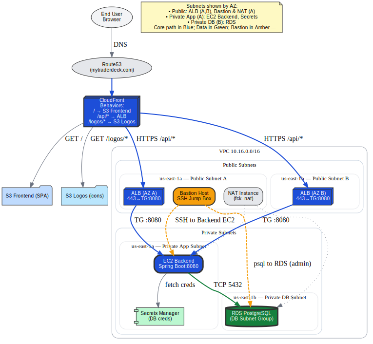

# TraderDeck Cloud

## Overview
TraderDeck Cloud contains the infrastructure-as-code (IaC), architecture notes, and cloud resource definitions for deploying and operating the TraderDeck platform on AWS.

## Cloud Architecture Diagram

## Architecture
- **Edge/Delivery:**
  - Route53 (DNS), CloudFront (CDN), ACM (TLS)
  - CloudFront origins: S3 (frontend), ALB (API), S3 (logos)
- **VPC & Networking:**
  - Public/private subnets, custom NAT instance, security groups, route tables
- **Compute/Application:**
  - EC2 backend (Spring Boot), ALB, Bastion host
- **Data:**
  - RDS PostgreSQL (private), AWS Secrets Manager
- **Storage & Assets:**
  - S3 buckets for frontend, logos, misc data
- **Serverless:**
  - Lambda functions for asset management and metadata
- **Security Controls:**
  - Security groups, IAM roles, bucket policies
- **Traffic Flows:**
  - End user requests, Lambda triggers, admin SSH

## Technical Docs
- See [architecture-overview.md](IaC/architecture-overview.md) for a detailed cloud architecture description

## Infrastructure-as-Code
- Terraform modules for VPC, EC2, ALB, RDS, S3, Lambdas, IAM, networking
- Resource definitions and configuration files in `IaC/`

